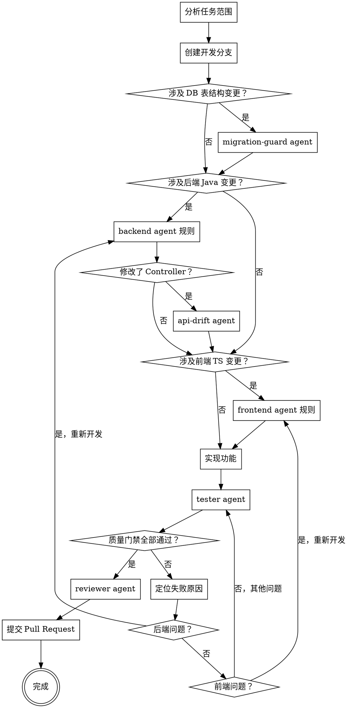

# SkillHub 开发工作流

## 概述

编排 SkillHub 项目级 agents。分析任务涉及的范围，按顺序激活对应 agent，在完成前强制通过质量门禁。

## Agent 概览

| Agent | 定义文件 | 负责内容 | 触发时机 | 关键产出 |
|---|---|---|---|---|
| `migration-guard` | `.claude/agents/migration-guard.md` | Flyway migration 校验 | 新增/修改 `server/skillhub-app/src/main/resources/db/migration/V*.sql` | 版本号连续性结论、是否误改历史 migration |
| `backend` | `.claude/agents/backend.md` | 后端 Java 实现（Spring Boot / 分层架构 / Flyway） | 修改 `server/**/*.java` 或新增后端能力 | 代码实现、分层合规、API 规范符合性 |
| `api-drift` | `.claude/agents/api-drift.md` | OpenAPI 与前端类型漂移检查 | 修改 Controller（`server/**/controller/**/*.java`）后 | `make generate-api` 执行提示、`schema.d.ts` 是否需提交 |
| `frontend` | `.claude/agents/frontend.md` | 前端 TypeScript/React 实现 | 修改 `web/src/**/*.ts(x)` 或新增前端功能 | 代码实现、i18n 合规、API 层调用合规 |
| `tester` | `.claude/agents/tester.md` | 测试编写与质量门禁执行（重点：Playwright MCP E2E） | 功能实现完成后、准备宣称完成前 | Vitest/SpringBoot/Playwright MCP 验证结果与失败定位 |
| `reviewer` | `.claude/agents/reviewer.md` | 结构化代码审查与合并前验收 | 质量门禁全部通过后 | 带文件路径和行号的审查清单（✅/⚠️/❌） |

## 调度原则

- 按依赖顺序调度：`migration-guard → backend/api-drift → frontend → tester → reviewer`
- `api-drift` 不是独立开发阶段，而是 **Controller 变更后的契约同步检查**
- `tester` 失败后必须回流到对应开发 agent 修复，再次进入质量门禁
- **涉及 UI 交互/路由/权限/跨页面流程时，tester 阶段必须执行 Playwright MCP E2E，不得只用单测替代**
- `reviewer` 只在质量门禁通过后执行，不可前置

## 工作流



## 阶段零 — 创建开发分支

开始任何实现之前,必须从 `main`(或 `develop`)切出一条独立分支:

```bash
git checkout main && git pull
git checkout -b <type>/<short-description>
```

**分支类型映射**:

| 任务类型 | 分支前缀 | 示例 |
|---|---|---|
| 新功能 | `feature/` | `feature/user-skill-export` |
| 缺陷修复 | `fix/` | `fix/login-token-expire` |
| 文档更新 | `docs/` | `docs/api-readme` |
| 重构(无行为变更)| `refactor/` | `refactor/skill-service-layer` |
| 性能优化 | `perf/` | `perf/skill-list-query` |
| 测试补充 | `test/` | `test/skill-controller-cases` |
| CI/构建/配置 | `chore/` | `chore/update-makefile` |

**规则**:
- `short-description` 使用 kebab-case,简洁描述目标(≤ 5 词)
- 禁止直接在 `main` / `develop` 上提交功能代码
- 一个分支对应一个功能/修复,不混用

## 阶段一 — 分析范围

写代码之前,先运行 `git status`,结合任务描述判断变更类型:

| 信号 | 激活的 Agent |
|---|---|
| 新增或修改 `db/migration/V*.sql` | migration-guard |
| 修改 `server/**/*.java` | backend |
| 修改 `server/**/controller/**/*.java` | api-drift(实现后触发) |
| 修改 `web/src/**/*.ts(x)` | frontend |

## 阶段二 — 实现前检查

### DB Migration(migration-guard)
- 新文件版本号必须 = 当前最高版本 + 1,以当前工作树中最高的 `V*.sql` 为准(当前这份工作树已看到 `V39`,下一个应为 `V40+`)
- 确认未修改任何已有 `V*.sql` 文件
- 通过后才能开始实现 schema 变更

### 后端规则(backend agent)
实现过程中遵守:
- 依赖方向:`domain` ← `infra` ← `app`,禁止反向
- Controller 只做传输层,不写业务逻辑
- API 响应统一 `{ code, msg, data, timestamp, requestId }`,`msg` 通过 `LocaleContextHolder` 解析
- 用户 ID 全为 `string`;二进制流接口(`/download`)豁免统一包装

### 前端规则(frontend agent)
实现过程中遵守:
- 禁止手动编辑 `web/src/api/generated/schema.d.ts`
- 禁止硬编码用户可见文案,必须使用 i18n key
- 优先复用 `web/src/shared/ui/` 中已有组件
- 文件名 kebab-case,2 空格缩进,不加分号

## 阶段三 — 实现后检查

### API Drift(api-drift)— 修改了 Controller 时必做
```bash
make generate-api
git diff --name-only HEAD -- web/src/api/generated/schema.d.ts
```
有 diff → 将 `web/src/api/generated/schema.d.ts` 加入本次提交。

## 阶段四 — 测试(tester agent,E2E 优先)

标记任务完成之前必须编写测试:

| 变更类型 | 需要的测试 |
|---|---|
| 前端逻辑 | Vitest 单测,与源文件同目录,kebab-case 命名 |
| 后端 Controller | `@SpringBootTest + @AutoConfigureMockMvc + @MockBean` |
| UI 交互流程 | **Playwright MCP E2E(必做)**,并保留截图/日志证据 |

### Playwright MCP E2E(重点)

- 触发条件:改动涉及页面跳转、表单提交流程、鉴权/权限、关键用户路径(创建/编辑/删除/发布等)
- 最低要求:覆盖至少 1 条成功路径 + 1 条失败/边界路径
- 推荐执行流:`browser_navigate` → `browser_snapshot`(定位元素)→ `browser_click`/`browser_fill_form` → `browser_wait_for` → `browser_take_screenshot`
- 证据沉淀:关键步骤截图保存到 `web/test/screenshots/`,并在结论中附失败定位信息

## 阶段五 — 质量门禁

全部通过后才能进入代码审查:

| 检查项 | 命令 | 通过条件 |
|---|---|---|
| TypeScript 类型检查 | `make typecheck-web` | 0 errors |
| ESLint | `make lint-web` | 0 errors,0 warnings |
| 前端单测 | `make test-frontend` | 全部通过 |
| 后端单测 | `make test-backend-app` | 全部通过(有后端变更时执行) |
| E2E 关键路径回归 | Playwright MCP(`browser_*` 工具链) | 关键路径通过,且截图/日志可追溯 |

### 质量门禁失败处理流程

如果任何检查项未通过,必须:

1. **定位失败原因** — 分析错误日志,确定是后端、前端还是其他问题
2. **路由到对应 Agent 重新开发**:
   - 后端单测失败 / 后端类型错误 → 回到 **backend agent 规则**,重新实现
   - 前端单测失败 / TypeScript 错误 / ESLint 错误 → 回到 **frontend agent 规则**,重新实现
   - Playwright MCP E2E 失败(UI 交互/路由问题)→ 回到 **frontend agent 规则**,必要时联动 **backend agent**
   - 测试本身有问题 → 回到 **tester agent**,修复测试代码
3. **修复后重新执行质量门禁** — 循环直到全部通过

**禁止**:
- 跳过失败的检查项直接进入代码审查
- 在质量门禁未全部通过时标记任务完成
- 修改测试代码以绕过真实的代码问题

## 阶段六 — 代码审查(reviewer agent)

按 7 个维度执行 reviewer agent 检查清单:
1. 分层合规(无 `domain → infra` 反向依赖)
2. API 契约(响应结构、LocaleContextHolder、二进制流豁免)
3. API Drift(schema.d.ts 已同步)
4. 前端类型安全(无 `any`,无绕过 api 层直接请求)
5. i18n 合规(无硬编码文案)
6. 测试覆盖(新功能有对应测试)
7. 提交规范(Conventional Commits,作者不含 AI 工具名)

## 阶段七 — 提交 Pull Request

代码审查通过后,使用 gh 创建 PR,PR 描述必须包含以下结构化内容:

### PR 模板结构

```markdown
## 概述
[一句话描述本次变更的目标和动机]

## 变更内容

### 后端实现
- [列出关键的后端变更,包括新增/修改的类、接口、服务层逻辑]
- [DB migration 变更(如有)]
- [API 契约变更(如有)]

### 前端实现
- [列出关键的前端变更,包括新增/修改的组件、页面、路由]
- [状态管理变更(如有)]
- [UI/UX 改进(如有)]

### 测试覆盖
- 后端单测:[列出新增/修改的测试类和覆盖的场景]
- 前端单测:[列出新增/修改的测试文件和覆盖的场景]
- E2E 测试:[列出 Playwright MCP 验证的关键路径,附截图路径]

## 质量门禁

- [ ] `make typecheck-web` 通过(0 errors)
- [ ] `make lint-web` 通过(0 errors, 0 warnings)
- [ ] `make test-frontend` 通过
- [ ] `make test-backend-app` 通过(如有后端变更)
- [ ] Playwright MCP E2E 关键路径通过(如有 UI 交互变更)
- [ ] `make generate-api` 已执行且 `schema.d.ts` 已提交(如有 Controller 变更)

## 安全考虑

- [列出本次变更涉及的安全相关内容,例如:]
  - 鉴权/授权变更
  - 敏感数据处理
  - 输入验证
  - SQL 注入/XSS 防护
  - 依赖项安全更新
- [如无安全相关变更,填写"本次变更不涉及安全敏感内容"]

## 相关 Issue

Closes #[issue_number]
或
Related to #[issue_number]

## 测试说明

### 本地验证步骤
1. [列出 reviewer 需要执行的本地验证步骤]
2. [包括如何启动服务、访问哪些页面、执行哪些操作]
3. [预期结果是什么]

### 回归测试范围
- [列出可能受影响的功能模块]
- [建议的回归测试路径]

### 截图/录屏(如有 UI 变更)
[附上关键页面的截图或操作流程的录屏]
```

### PR 提交检查清单

提交 PR 前必须确认:

| 检查项 | 说明 |
|---|---|
| 分支命名规范 | 符合 `<type>/<short-description>` 格式 |
| Commit 规范 | 所有 commit 符合 Conventional Commits 格式 |
| Commit 作者 | 不包含 AI 工具名称(Claude Code、Codex、Gemini 等)|
| PR 标题 | 简洁明确,格式:`type(scope): description` |
| PR 描述完整 | 包含上述模板的所有必填章节 |
| 质量门禁全通过 | 所有检查项已勾选 ✅ |
| 代码审查已完成 | reviewer agent 检查清单无 ❌ 项 |
| 相关 Issue 已关联 | 使用 `Closes #` 或 `Related to #` |
| 敏感信息已移除 | 无硬编码密钥、token、内部 URL |

### PR 提交命令

```bash
# 方式一:使用 Makefile(推荐)
make pr

# 方式二:手动提交
git push -u origin <branch-name>
gh pr create --title "feat(scope): description" --body "$(cat PR_TEMPLATE.md)"
```

### PR 审查要点

提交后,PR reviewer 将重点关注:

1. **架构合规性** — 分层依赖、模块边界
2. **API 契约一致性** — 响应格式、错误码、i18n
3. **测试充分性** — 覆盖率、边界场景、E2E 关键路径
4. **安全风险** — 注入漏洞、权限绕过、敏感数据泄露
5. **性能影响** — N+1 查询、大对象序列化、前端包体积
6. **可维护性** — 代码可读性、注释必要性、重复代码

## 快速参考 — Agent 调用方式

```
"使用 migration-guard agent"   → DB migration 校验
"使用 backend agent"           → 后端 Java 规则
"使用 frontend agent"          → 前端 TS 规则
"使用 api-drift agent"         → 修改 Controller 后触发
"使用 tester agent"            → 编写测试 + 质量门禁
"使用 reviewer agent"          → 合并前代码审查
```

## 禁止跳过

- **直接在 `main` / `develop` 上提交功能代码,未创建对应类型分支**
- 有 DB 变更时跳过 migration-guard 直接开始实现
- 修改 Controller 后忘记运行 `make generate-api`
- **质量门禁未全部通过就标记任务完成或进入代码审查**
- **质量门禁失败时不定位原因、不回到对应 Agent 重新开发**
- 结尾跳过 reviewer agent
